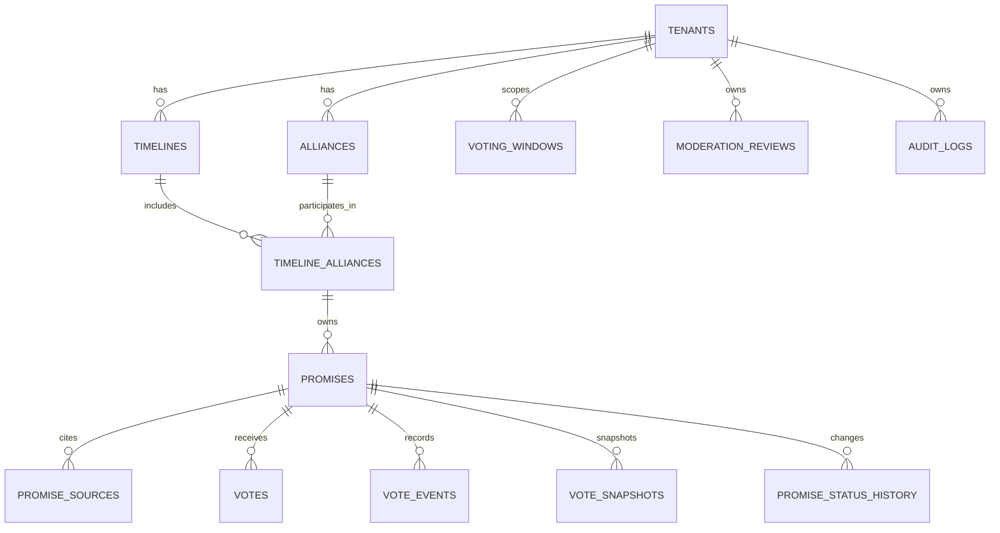

# Database Relationships

This document shows the recommended database shape for alliance-aware election tracking.

## Current State In Repo

The current database schema already includes core tables such as `tenants`, `promises`, `promise_sources`, `votes`, `vote_events`, `vote_snapshots`, `voting_windows`, `moderation_reviews`, and `audit_logs`.

What is missing today is the normalized election structure for:

- `timelines`
- `alliances`
- a join table that links alliances to election timelines

Right now, the `promises` table still stores election context as plain columns such as `jurisdiction`, `election`, and `person_party`.

## Recommended Relationship Model

The best fit is not “tenant to alliance many-to-many” directly.

The cleaner model is:

- one `tenant` has many `timelines`
- one `tenant` has many `alliances`
- `alliances` and `timelines` are many-to-many through a join table
- one `timeline_alliance` row has many `promises`

That gives you:

- many alliances inside the same Tamil Nadu 2026 election timeline
- the same alliance reused in Tamil Nadu 2031 without duplicating the alliance identity
- strong integrity so a promise cannot accidentally point at a Tamil Nadu timeline and an unrelated alliance

## Logical ERD



## Recommended Tables

### tenants

Existing top-level jurisdiction or workspace table.

Example row:

- `id = tenant-tamilnadu`
- `slug = tamilnadu`

### timelines

Represents an election cycle or governing term inside a tenant.

Suggested columns:

- `id`
- `tenant_id` FK -> `tenants.id`
- `slug` such as `2026`
- `year`
- `election_label` such as `Tamil Nadu Assembly Election 2026`
- `start_date`
- `end_date`
- `is_active`

Suggested constraint:

- unique `(tenant_id, slug)`

### alliances

Represents a political alliance identity within a tenant.

Suggested columns:

- `id`
- `tenant_id` FK -> `tenants.id`
- `slug`
- `name`
- `short_name`
- `alliance_type`
- `metadata` JSONB

Suggested constraint:

- unique `(tenant_id, slug)`

### timeline_alliances

Join table that links an alliance to a specific election timeline.

Suggested columns:

- `id`
- `tenant_id` FK -> `tenants.id`
- `timeline_id` FK -> `timelines.id`
- `alliance_id` FK -> `alliances.id`
- `ballot_label`
- `manifesto_url`
- `notes`

Suggested constraint:

- unique `(timeline_id, alliance_id)`

Why keep `tenant_id` here too:

- easier tenant-scoped querying
- simpler row-level authorization checks
- easier indexing for multi-tenant workloads

### promises

Promises should hang off `timeline_alliances`, not directly off a raw alliance name string.

Suggested columns:

- `id`
- `tenant_id` FK -> `tenants.id`
- `timeline_id` FK -> `timelines.id`
- `timeline_alliance_id` FK -> `timeline_alliances.id`
- `title`
- `description`
- `category`
- `jurisdiction`
- `status`
- `person_party`
- `created_by`
- timestamps

Important note:

- If you keep both `timeline_id` and `timeline_alliance_id`, the app should validate that the referenced `timeline_alliance` belongs to the same `tenant_id` and `timeline_id`.
- A stricter alternative is to store only `timeline_alliance_id` and derive timeline and alliance through joins.

## Relationship Summary

Recommended cardinality:

- `tenant -> timelines` = one-to-many
- `tenant -> alliances` = one-to-many
- `timeline -> alliances` = many-to-many through `timeline_alliances`
- `timeline_alliance -> promises` = one-to-many

So the answer to your question is:

- `tenant` to `alliance` should usually be one-to-many, not many-to-many
- `tenant` to `timeline` should usually be one-to-many, not many-to-many
- `timeline` to `alliance` is the place where many-to-many makes sense

## Example: Tamil Nadu 2026

For Tamil Nadu 2026, the rows would look like this:

### tenants

- `tenant-tamilnadu`

### timelines

- `timeline-tn-2026` for Tamil Nadu Assembly Election 2026

### alliances

- `alliance-progress-alliance`
- `alliance-people-first-front`

### timeline_alliances

- `tn-2026-progress-alliance` links `timeline-tn-2026` to `alliance-progress-alliance`
- `tn-2026-people-first-front` links `timeline-tn-2026` to `alliance-people-first-front`

### promises

- electric buses promise -> `tn-2026-progress-alliance`
- climate jobs promise -> `tn-2026-progress-alliance`
- ration digitization promise -> `tn-2026-people-first-front`
- rural clinics promise -> `tn-2026-people-first-front`

## Suggested SQL Shape

```sql
create table timelines (
  id text primary key,
  tenant_id text not null references tenants(id) on delete cascade,
  slug text not null,
  year integer not null,
  election_label text not null,
  start_date timestamptz,
  end_date timestamptz,
  is_active boolean not null default false,
  unique (tenant_id, slug)
);

create table alliances (
  id text primary key,
  tenant_id text not null references tenants(id) on delete cascade,
  slug text not null,
  name text not null,
  short_name text,
  alliance_type text,
  metadata jsonb not null default '{}'::jsonb,
  unique (tenant_id, slug)
);

create table timeline_alliances (
  id text primary key,
  tenant_id text not null references tenants(id) on delete cascade,
  timeline_id text not null references timelines(id) on delete cascade,
  alliance_id text not null references alliances(id) on delete cascade,
  ballot_label text,
  manifesto_url text,
  notes text,
  unique (timeline_id, alliance_id)
);

alter table promises
  add column timeline_id text references timelines(id) on delete cascade,
  add column timeline_alliance_id text references timeline_alliances(id) on delete set null;
```

## Recommended Next Migration Slice

If we implement this in the app, the next database change should be:

1. add `timelines`
2. add `alliances`
3. add `timeline_alliances`
4. add `timeline_id` and `timeline_alliance_id` to `promises`
5. backfill existing promise rows from current `election` and `person_party` fields
6. move UI filters and admin forms to use the new foreign keys

That keeps the migration incremental instead of rewriting the full promise model in one step.