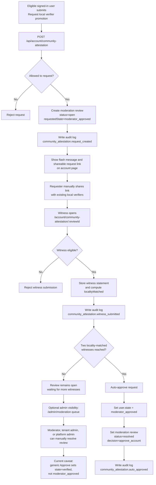

# Community Attestation Workflow

This document describes the current implementation behind the account-page action "Request local verifier promotion".

## Short answer

A submitted request does not automatically notify anyone by email, SMS, or an internal notification system.

What happens instead:

- The app creates an open moderation review record for the account.
- The requester sees a shareable request link on the account page.
- The requester must share that link manually with people who can vouch for them.
- Only users already in state `moderator_approved` can submit witness statements.
- When two witness statements match the requester's locality rules, the system auto-promotes the requester to `moderator_approved`.

## Who is notified

There is no automatic outbound notification in the current code path.

The current implementation records internal state only:

- A moderation review row is created.
- Audit log entries are written for request creation, witness submission, and automatic approval.
- The requester gets a flash message and a shareable witness link on the account page.

This means:

- Moderators are not emailed.
- Existing local verifiers are not emailed or texted.
- The requester has to manually circulate the link.

## Who can witness the request

A witness must satisfy all of these conditions:

- Be signed in.
- Not be the same user who created the request.
- Not have already witnessed the same request.
- Not be in `guest`, `readonly`, or `suspended` state.
- Be in state `moderator_approved`.

In practice, the witness is an already-approved local verifier, not a general moderator.

## Who approves or promotes the requester

### Automatic promotion path

This is the main promotion path in the current implementation.

After each witness submission, the app compares the witness location against the request location:

- City must match.
- If both postal codes are present, postal code must match.
- Otherwise, if both localities are present, locality must match.
- If city matches and neither of the tighter comparisons is available, the witness still counts as a locality match.

When the request reaches `2` locality-matched witness statements:

- The app updates the requester's user record to `state = moderator_approved`.
- The moderation review is marked `resolved` with `decision = approve_account`.
- An audit log entry is written with action `community_attestation.auto_approved`.

### Manual moderation surface

There is also an admin moderation queue at `/admin/moderation`.

Users who can access that queue are:

- `moderator`
- `tenant_admin`
- `platform_admin`

Tenant access still applies, so the reviewer must also be allowed to access the request's tenant unless they are a platform admin.

Important caveat in the current implementation:

- The generic moderation queue can resolve the open review.
- But its normal `Approve` action sets the user state to `verified`, not `moderator_approved`.
- So the moderation queue does not currently perform the intended local-verifier promotion in the same way the automatic witness threshold does.

Because of that, the actual promotion-to-verifier behavior is currently driven by the automatic witness-threshold path, not by a moderator clicking Approve in the queue.

## End-to-end flow

1. An eligible signed-in user submits the "Request local verifier promotion" form from the account page.
2. The API creates a moderation review with community-attestation metadata and requested state `moderator_approved`.
3. The app writes an audit log entry for `community_attestation.request_created`.
4. The account page shows a shareable request link.
5. The requester manually sends that link to existing `moderator_approved` users who know them locally.
6. Each eligible witness opens the link and submits a witness statement.
7. The app stores each witness statement, computes whether it matches the request locality, and writes `community_attestation.witness_submitted` to the audit log.
8. If fewer than two locality-matched witnesses exist, the review stays open.
9. Once two locality-matched witnesses exist, the app auto-resolves the request and promotes the requester to `moderator_approved`.
10. The app writes `community_attestation.auto_approved` to the audit log.

## Mermaid diagram

## Source files checked

- `src/app/api/account/community-attestation/route.ts`
- `src/app/api/account/community-attestation/[reviewId]/witness/route.ts`
- `src/modules/auth/community-attestations.ts`
- `src/modules/moderation/reviews.ts`
- `src/app/admin/moderation/page.tsx`
- `src/components/moderation/review-queue.tsx`
- `src/lib/permissions.ts`
- `tests/community-attestation.test.ts`
